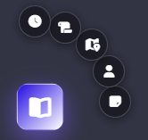
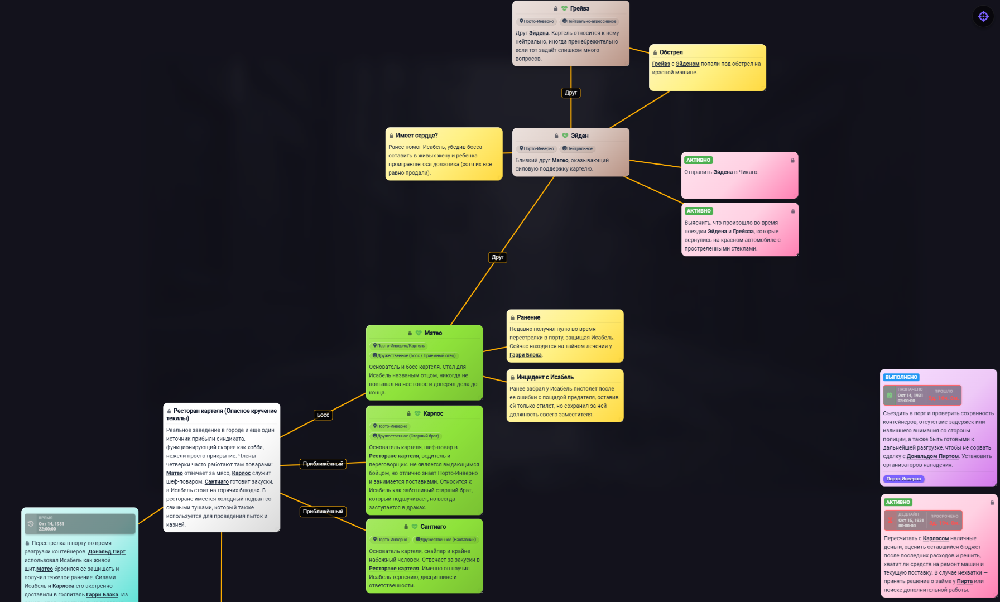
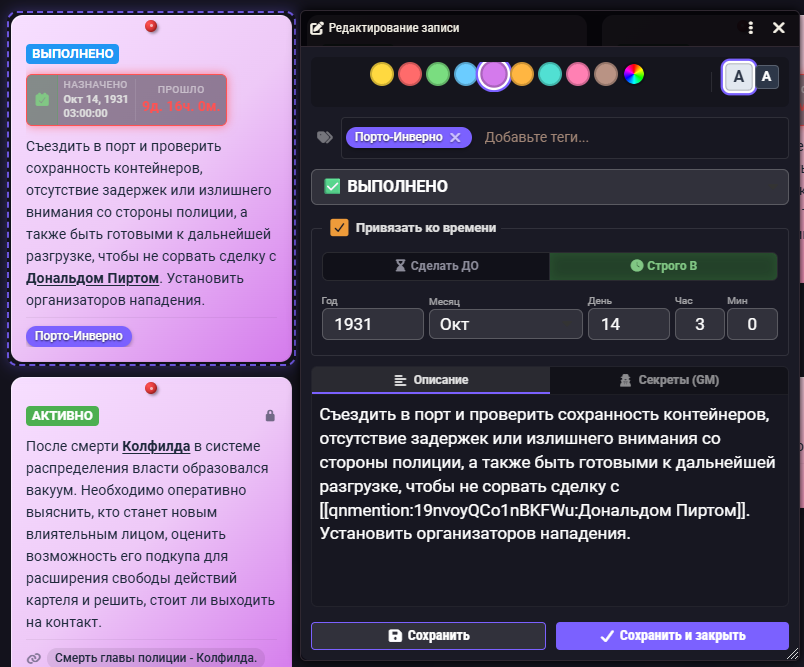

# ClueBook

*Читать на [Русском](README_RU.md)*

ClueBook is a handy module for Foundry VTT that helps you take notes, manage quests, and link clues on an interactive detective board.

## Key Features
* Floating widget for quickly creating notes, NPCs, locations, quests, and timeline events.
* Detective Board for visually establishing connections.
* In-game calendar integration (tracking time and deadlines), supports Simple Calendar Reborn and Ginzzzu's Portraits & NPC Dock.
* Built-in tag system for convenient sorting.

## Screenshots

### Floating Widget
A convenient radial menu for quickly creating notes, quests, locations, and NPCs right on top of your screen.

### Detective Board
An interactive board where you can visually link (draw lines between) cards so you don't get lost in your investigation.

### Quest Edit Window
Deadline setup (linked to the calendar), colored categories, tags, and a user-friendly text editor.

## Additional Features
* **GM Tools**: Right from the board, the GM can trigger macros, play playlists and sounds, activate scenes, and open character sheets (NPCs and players) with a single click.
* **@ Mentions**: Type `@` in any note's text to quickly find and reference another entry, character, item, or journal.
* **Drag & Drop**: You can grab and drag entities (actors, items, other journals) from the sidebar directly into a note's text — the module will automatically grab the UUID and create a neat link.
* **Visual Connections**: On the detective board, you can connect cards to each other to clearly see how clues, locations, and characters relate.
* **Quest Deadlines**: In a quest or event's settings, you can set a start date and a deadline — they will sync with the world's global time.

## Installation
1. Copy the manifest link:
   `https://github.com/MigaSu/ClueBook/releases/latest/download/module.json`
2. In Foundry VTT, go to the **Add-on Modules** tab and click **Install Module**.
3. Paste the link into the **Manifest URL** field and click Install.

---
*Special thanks to AI 3.1 for assisting with the architecture design and some parts of the code.*
